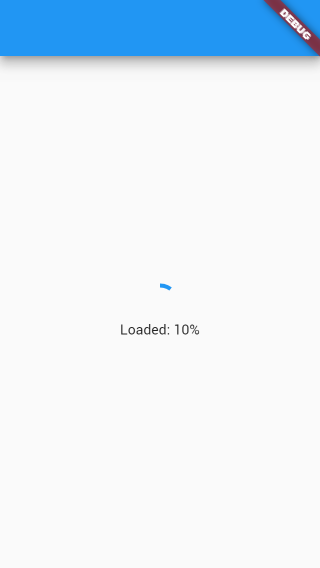
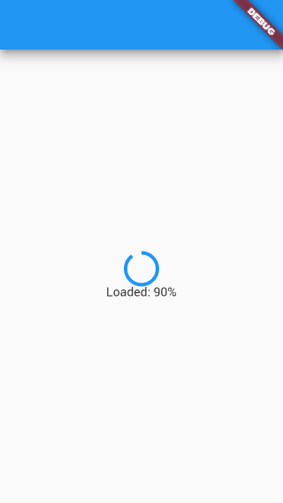
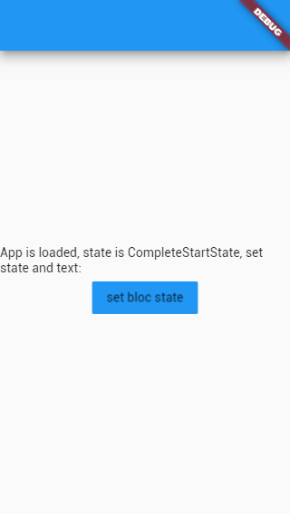
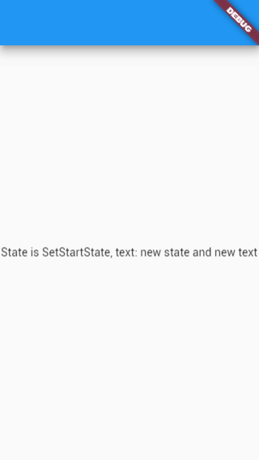

# example_bloc_load_state

Это базовый пример BLOC архитектуры в Flutter приложении на основе готовых пакетов из pub.dev.

## Подключение зависимостей

Подключение необходимых пакетов в <pubspec.yaml> для данного примера.

### bloc
<https://pub.dev/packages/bloc>

Используется для создания блок-классов от супер-класса **Bloc**.

### flutter_bloc
<https://pub.dev/packages/flutter_bloc>

Из этой библиотеки используется виджеты **BlocBuilder** и **BlocProvider**.

## Цели и задачи
Создать BLOC - StartBloc в котором будет бизнес-логика главного экрана.
Создать экран StartScreen поведение которого будет зависеть от StartBloc.

1. нужно создать и заполнить шаблоны в директории <lib/bloc/start/>
  - <lib/bloc/start/bloc.dart> - связующий файл между: bloc, state, event
  - <lib/bloc/start/start_bloc.dart> - тут будет сам управляющий блок **StartBloc**
  - <lib/bloc/start/start_state.dart> - тут будут состояния **StartState** для блока **StartBloc**
  - <lib/bloc/start/start_event.dart> - тут будут события/действия **StartEvent** для блока **StartBloc**
  
2. блок **StartBloc** имеет несколько состояний
  - **LoadStartState** будет начальным и будет отображать состояние загрузки,для примера будет изменяться
  по таймеру внутри блока
  - **CompleteStartState** установится когда пройдет "загрузка"
  - **SetStartState** в это состояние можно будет перейти по нажатию на кнопку
  
3. Создать виджет экрана **StartScreen**
  - <lib/screen/start_screen.dart>
  - определить виджет **BlocProvider** для создания блока **StartBloc**
  - определить виджет **BlocBuilder** для перестроения дерева виджетов, когда будет меняться состояние **StartBloc**
  - использовать **BlocProvider** для вызова событий **StartEvent** вне блока **StartBloc**
  
   
  
## Контакты
Пример подготовлен для сайта <https://flutter.su> и YouTube канала <https://www.youtube.com/c/TutorialFlutter>
Вопросы можно добавить в issue или на почту <contact@flutter.su>